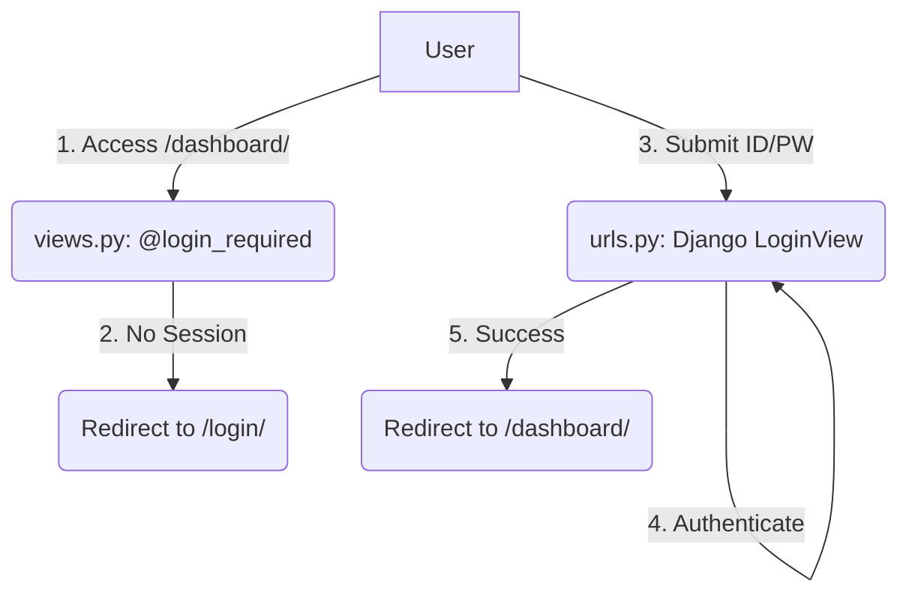

# Implementation Plan: 001. 로그인 및 대시보드 접근

이 문서는 유스케이스 명세 `001`을 구현하기 위한 모듈 설계안입니다.

---

## 개요

Django의 내장 인증 시스템을 활용하여, 별도의 복잡한 로직 구현 없이 인증 기능을 완성합니다.

| 모듈 이름 | 위치 | 설명 |
| :--- | :--- | :--- |
| **Authentication** | `config/urls.py` | Django 내장 `LoginView`, `LogoutView`를 URL에 연결하여 인증 처리. |
| **Access Control** | `apps/dashboard/views.py` | `@method_decorator(login_required)`를 사용하여 비로그인 사용자의 접근을 제어. |

---

## Diagram

---

## Implementation Plan

### 1. `config/urls.py`: 내장 뷰 연결
-   **구현 내용:**
    -   `django.contrib.auth.views`에서 `LoginView`, `LogoutView`를 import 합니다.
    -   `path('login/', LoginView.as_view(template_name='...'), name='login')` 형태로 URL 패턴을 추가합니다.
    -   `LoginView`에 `redirect_authenticated_user = True` 옵션을 설정하여, 이미 로그인한 사용자가 `/login` 페이지 접근 시 대시보드로 리다이렉트시킵니다.

### 2. `apps/dashboard/views.py`: 접근 제어
-   **구현 내용:**
    -   `DashboardView`와 `ChartDataAPIView` 클래스에 `@method_decorator(login_required, name='dispatch')`를 적용하여, 로그인된 사용자만 접근할 수 있도록 설정합니다.

### 3. `templates/`: 로그인 템플릿
-   **구현 내용:**
    -   `LoginView`가 사용할 간단한 로그인 폼 템플릿을 작성합니다. (e.g., `templates/registration/login.html`)

---

## QA Sheet

| 시나리오 | 예상 결과 |
| :--- | :--- |
| **TC-01** | 비로그인 상태로 `/dashboard/`에 접근 | `/login/?next=/dashboard/` 경로로 리다이렉트된다. |
| **TC-02** | 로그인 후 `/login/` 페이지에 접근 | `/dashboard/` (또는 `settings.LOGIN_REDIRECT_URL`)로 리다이렉트된다. |
| **TC-03** | 비로그인 상태로 `/api/dashboard/chart-data/` API 호출 | 401 Unauthorized 응답 또는 로그인 페이지로 리다이렉트된다. |
| **TC-04** | 잘못된 ID/PW로 로그인 시도 | 로그인 폼에 "ID 또는 비밀번호가 올바르지 않습니다." 오류 메시지가 표시된다. |
