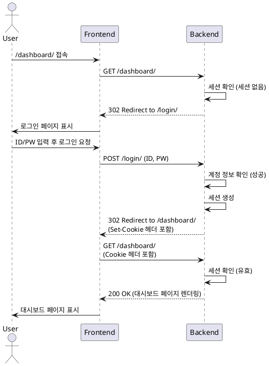

# 유스케이스 명세: 001. 로그인 및 대시보드 접근

- **Primary Actor**: 내부 직원 (User), 관리자 (Admin)
- **Precondition**: 사용자는 자신의 계정(ID/PW)을 알고 있다.
- **Trigger**: 사용자가 시스템에 할당된 URL(e.g., `/` 또는 `/dashboard/`)에 접속한다.

---

### Main Scenario

1.  사용자가 웹 브라우저로 시스템 URL에 접근한다.
2.  시스템(BE)은 사용자의 요청에 유효한 세션이 있는지 확인한다.
3.  세션이 없으면, 시스템은 로그인 페이지(`/login/`)로 리다이렉트한다.
4.  사용자는 ID와 비밀번호를 입력하고 '로그인' 버튼을 클릭한다.
5.  시스템은 계정 정보를 확인하여 유효성을 검증한다.
6.  인증에 성공하면, 시스템은 사용자 세션을 생성하고 쿠키를 발급한다.
7.  시스템은 사용자를 메인 대시보드 페이지(`/dashboard/`)로 리다이렉트한다.
8.  사용자는 대시보드에 표시된 차트를 확인한다.

---

### Edge Cases

-   **인증 실패**: 잘못된 ID/PW 입력 시, 로그인 폼에 "ID 또는 비밀번호가 올바르지 않습니다." 메시지를 표시한다. (별도 시도 횟수 제한 없음)
-   **권한 없는 페이지 접근**: 일반 사용자(`is_staff=False`)가 관리자 페이지(`/admin/`) 접근 시, 403 Forbidden 에러 페이지를 표시한다.
-   **이미 로그인된 사용자**: 유효한 세션을 가진 사용자가 로그인 페이지(`/login/`)에 접근 시, 대시보드(`/dashboard/`)로 즉시 리다이렉트한다.

---

### Business Rules

-   인증은 Django의 기본 세션 인증 방식을 사용한다.
-   보안을 위한 추가 기능(2FA, 동시 로그인 제어, 계정 잠금)은 MVP 범위에 포함하지 않는다.
-   모든 인증 관련 로그는 Django Admin의 기본 로그 기록을 따른다.

---

### Sequence Diagram

