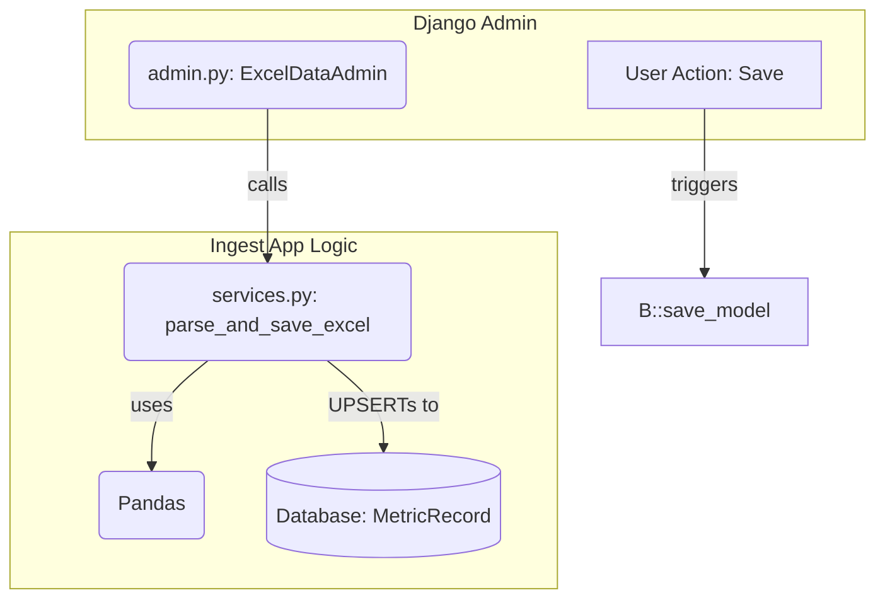

# Implementation Plan: 002. 엑셀 업로드 (v1.1)

이 문서는 유스케이스 명세 `002`를 구현하기 위한 모듈 설계안입니다.

---

## 개요

Django Admin의 `save_model`을 오버라이드하여, `ingest` 앱의 `services.py`에 구현된 핵심 파싱 로직을 호출하는 방식으로 구현합니다. **파일 업로드 폼은 DB 테이블을 생성하지 않는 `forms.Form`을 사용합니다.**

| 모듈 이름 | 위치 | 설명 |
| :--- | :--- | :--- |
| **Ingest Service** | `apps/ingest/services.py` | `parse_and_save_excel` 함수. pandas 파싱, 데이터 정규화, DB UPSERT 등 핵심 로직 담당. |
| **Ingest Admin** | `apps/ingest/admin.py` | `ExcelDataAdmin` 클래스. **DB 테이블을 생성하지 않는 `forms.Form`을 사용하여** 파일 업로드 폼을 제공하고, `save_model`을 오버라이드하여 Ingest Service를 호출하는 진입점. |

---

## Diagram

---

## Implementation Plan

### 1. `apps/ingest/services.py` - Ingest Service
-   **구현 내용:**
    -   `parse_and_save_excel(file_obj)` 함수를 구현합니다.
    -   내부에 `_validate_columns`, `_normalize_row`, `_upsert_metric_record` 등의 private 함수를 두어 역할을 분리합니다.
    -   `_normalize_row`에는 `dataflow.md`에 명시된 `department`, `metric_type` 정규화 로직을 포함합니다.
    -   각 행을 처리하며 발생하는 오류는 `try-except`로 잡아 실패 카운트를 올리고, 전체 프로세스는 중단하지 않습니다.
    -   최종적으로 성공/실패 카운트를 튜플 `(success_count, failure_count)` 형태로 반환합니다.
-   **Unit Test (`tests/test_services.py`):**
    | 테스트 케이스 | 검증 내용 |
    | :--- | :--- |
    | **성공 케이스** | 유효한 엑셀 파일 입력 시, 모든 행이 DB에 저장되고 성공 카운트가 일치하는지 검증 |
    | **부분 실패 케이스** | 숫자 컬럼에 문자가 포함된 행이 있을 때, 해당 행만 실패하고 나머지는 성공하는지 검증 |
    | **컬럼 누락 케이스** | 필수 컬럼이 없는 파일 입력 시, `ValidationError` 예외가 발생하는지 검증 |
    | **데이터 정규화** | "컴공과", " 컴퓨터 공학과 " 같은 문자열이 "컴퓨터공학과"로 정규화되어 저장되는지 검증 |

### 2. `apps/ingest/admin.py` - Ingest Admin
-   **구현 내용:**
    -   **DB 테이블을 생성하지 않는 `forms.Form` (e.g., `ExcelUploadForm`)을 정의하여 `FileField` 하나를 포함시킵니다.** 이 폼을 Admin에 등록하여 파일 업로드 UI를 제공합니다.
    -   `save_model(self, request, obj, form, change)` 메서드를 오버라이드합니다.
    -   메서드 내부에서 `form.cleaned_data['file']`을 가져와 `services.parse_and_save_excel` 함수를 호출합니다.
    -   **중요: `obj.save()`를 호출하지 않거나, `ExcelUploadForm`이 `models.Model`을 상속받지 않도록 하여 DB에 저장되지 않도록 합니다.**
    -   서비스의 반환 값을 `messages.success`를 통해 사용자에게 "총 N건 중 M건 성공, K건 실패" 형태로 피드백을 제공합니다.
-   **QA Sheet:**
    | 시나리오 | 예상 결과 |
    | :--- | :--- |
    | **TC-01** | Admin에서 유효한 엑셀 파일 업로드 | "총 150건 중 150건 성공, 0건 실패" 메시지가 표시된다. |
    | **TC-02** | 일부 오류가 있는 엑셀 파일 업로드 | "총 150건 중 148건 성공, 2건 실패" 메시지가 표시된다. |
    | **TC-03** | `.txt` 등 허용되지 않은 파일 업로드 | Django 폼 유효성 검사 오류가 표시된다. |