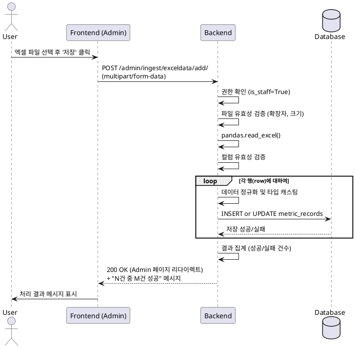

# 유스케이스 명세: 002. 엑셀 업로드

- **Primary Actor**: 관리자 (Admin)
- **Precondition**: 관리자는 `is_staff=True` 계정으로 로그인되어 있다. 관리자는 로컬 컴퓨터에 Ecount에서 추출한 엑셀/CSV 파일을 가지고 있다.
- **Trigger**: 관리자가 Django Admin의 `ExcelData` 추가 페이지에서 '저장' 버튼을 클릭한다.

---

### Main Scenario

1.  관리자가 Admin 페이지 사이드바에서 [Ingest] > [ExcelData] 메뉴로 이동한다.
2.  '엑셀 파일 추가' 버튼을 눌러 업로드 페이지로 진입한다.
3.  파일 선택 버튼을 눌러 로컬의 엑셀/CSV 파일을 선택한다.
4.  '저장' 버튼을 클릭하여 파일을 서버에 전송한다.
5.  시스템(BE)은 업로드된 파일을 받아 유효성을 검증한다. (확장자, 필수 컬럼)
6.  시스템은 `pandas`를 이용해 파일 내용을 한 줄씩 파싱한다.
7.  각 행의 데이터를 정규화하고, `metric_records` 테이블에 `UPSERT` (INSERT or UPDATE) 한다.
8.  처리가 완료되면, 시스템은 Admin 페이지 상단에 "총 N건 중 M건 성공, K건 실패" 요약 메시지를 표시한다.

---

### Edge Cases

-   **파일 확장자 오류**: 허용되지 않은 확장자(`.xls`, `.xlsx`, `.csv` 외) 파일 업로드 시, "허용되지 않는 파일 형식입니다." 메시지를 표시하고 폼을 다시 렌더링한다.
-   **필수 컬럼 누락**: 파일에 필수 컬럼(`year`, `department`, `metric_type`, `value`) 중 하나라도 없으면, "필수 컬럼이 누락되었습니다." 메시지를 표시하고 업로드를 중단한다.
-   **데이터 파싱 오류**: 특정 행의 값(e.g., 숫자여야 할 `value`에 문자열이 포함)이 잘못된 경우, 해당 행만 실패로 기록하고 다음 행 처리를 계속 진행한다(Partial Commit). 실패 내역은 서버 콘솔 로그에만 기록한다.
-   **파일 크기 초과**: Django 설정(10MB)을 초과하는 파일 업로드 시, 웹서버 레벨에서 차단되고 에러가 발생한다.

---

### Business Rules

-   업로드 기능은 Django Admin 프레임워크를 통해 제공된다.
-   데이터 저장은 `UNIQUE` 제약조건(`year`, `department`, `metric_type`)을 이용한 `UPSERT` 방식만 사용한다.
-   개별 행의 파싱 실패가 전체 업로드 실패를 유발하지 않는다 (Partial Commit 허용).
-   파싱 실패율이 20% 이상일 경우, 전체 업로드를 실패로 간주하고 롤백한다.

---

### Sequence Diagram

