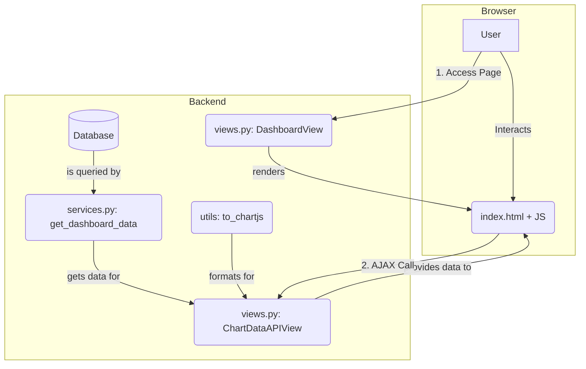

# Implementation Plan: 003. 대시보드 조회 및 시각화

이 문서는 유스케이스 명세 `003`을 구현하기 위한 모듈 설계안입니다.

---

## 개요

페이지 로드는 Django `TemplateView`가, 데이터 조회는 DRF `APIView`가 분담하여 처리합니다. BE와 FE는 템플릿 컨텍스트와 JSON으로 통신합니다.

| 모듈 이름 | 위치 | 설명 |
| :--- | :--- | :--- |
| **Dashboard View** | `apps/dashboard/views.py` | `DashboardView` (TemplateView). 대시보드 템플릿을 렌더링하고 기본 필터 값을 전달. |
| **Dashboard API** | `apps/dashboard/views.py` | `ChartDataAPIView` (APIView). 차트 데이터 요청을 받아 JSON으로 응답하는 DRF 엔드포인트. |
| **Dashboard Service** | `apps/dashboard/services.py` | `get_dashboard_data` 함수. API의 요청에 따라 DB에서 조건에 맞는 데이터를 조회. |
| **Chart Adapter** | `apps/dashboard/utils/chart_adapter.py` | `to_chartjs` 함수. DB 조회 결과를 Chart.js가 이해하는 포맷으로 변환하는 순수 함수. |
| **Frontend Script** | `templates/dashboard/index.html` | `<script>` 태그 내의 JavaScript. 필터 변경 시 API를 호출하고 Chart.js를 업데이트. |

---

## Diagram

---

## Implementation Plan

### 1. `apps/dashboard/views.py` - Dashboard View & API
-   **`DashboardView(LoginRequiredMixin, TemplateView)`:**
    -   `get_context_data`를 오버라이드하여, `default_filters` 딕셔너리(e.g., `{'years': [2025, 2024, 2023], 'departments': [...]}`)를 생성하고 템플릿에 전달합니다.
-   **`ChartDataAPIView(LoginRequiredMixin, APIView)`:**
    -   `get` 메서드에서 `request.query_params`를 파싱하여 `years`, `department` 변수를 추출합니다.
    -   `services.get_dashboard_data`와 `utils.to_chartjs`를 순차적으로 호출하여 최종 JSON을 생성하고 `Response` 객체로 반환합니다.

### 2. `apps/dashboard/services.py` - Dashboard Service
-   **구현 내용:**
    -   `get_dashboard_data(years: list, department: str = None)` 함수를 구현합니다.
    -   Django ORM을 사용하여 `metric_records` 테이블에서 `year__in=years` 와 같은 조건으로 데이터를 필터링합니다.
    -   `department`가 'all'이 아닐 경우, `department=department` 필터를 추가합니다.
-   **Unit Test (`tests/test_services.py`):**
    | 테스트 케이스 | 검증 내용 |
    | :--- | :--- |
    | **특정 학과 조회** | `years=[2023], department='컴퓨터공학과'` 호출 시, 정확히 해당 데이터만 반환되는지 검증 |
    | **전체 학과 조회** | `department='all'` 호출 시, 모든 학과 데이터가 포함되는지 검증 |

### 3. `apps/dashboard/utils/chart_adapter.py` - Chart Adapter
-   **구현 내용:**
    -   `to_chartjs(data: QuerySet)` 함수를 구현합니다.
    -   입력받은 `QuerySet`을 순회하며 `labels`와 `datasets` 구조로 재구성합니다.
-   **Unit Test (`tests/test_utils.py`):**
    | 테스트 케이스 | 검증 내용 |
    | :--- | :--- |
    | **정상 데이터 변환** | 유효한 `QuerySet` 입력 시, 올바른 Chart.js 포맷 딕셔너리가 생성되는지 검증 |
    | **빈 데이터 변환** | 빈 `QuerySet` 입력 시, `{"labels": [], "datasets": []}` 구조가 반환되는지 검증 |

### 4. `templates/dashboard/index.html` - Frontend Script
-   **구현 내용:**
    -   `{{ default_filters|json_script:"default-filters" }}` 코드로 Django 컨텍스트를 JS 변수로 변환합니다.
    -   페이지 로드 시, JS가 이 변수 값을 읽어 첫 API를 호출하는 로직을 작성합니다.
    -   필터 `<select>`의 `change` 이벤트를 감지하여, 변경된 값으로 API를 다시 호출하고 `Chart.js` 인스턴스의 `update()` 메서드로 차트를 갱신합니다.
-   **QA Sheet:**
    | 시나리오 | 예상 결과 |
    | :--- | :--- |
    | **TC-01** | 페이지 첫 로드 시, '최신 3개년' 데이터로 차트가 그려진다. |
    | **TC-02** | 학과 필터를 '컴퓨터공학과'로 변경 | 페이지 새로고침 없이 차트가 '컴퓨터공학과' 데이터로만 갱신된다. |
    | **TC-03** | API 응답이 비어있을 경우 | 차트 영역에 "표시할 데이터가 없습니다."와 같은 메시지가 나타난다. |
