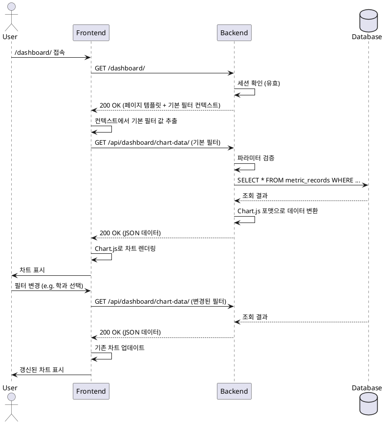

# 유스케이스 명세: 003. 대시보드 조회 및 시각화 (v1.1)

- **Primary Actor**: 내부 직원 (User)
- **Precondition**: 사용자는 시스템에 로그인되어 있다.
- **Trigger**: 사용자가 브라우저에서 `/dashboard/` 페이지에 접속하거나, 페이지 내 필터를 변경한다.

---

### Main Scenario

1.  사용자가 `/dashboard/` URL로 직접 접속하거나, 로그인 후 리다이렉트된다.
2.  시스템(BE)은 기본 필터 값(**'최신 3개년', '전체 학과'**)을 Django 템플릿 컨텍스트(e.g., `{'default_filters': ...}`)에 담아 대시보드 페이지를 렌더링하여 반환한다.
3.  브라우저(FE)는 페이지 로드 직후, 템플릿으로부터 전달받은 기본 필터 값으로 `/api/dashboard/chart-data/`에 GET 요청을 보낸다.
4.  시스템(BE)은 요청 파라미터를 기반으로 DB에서 해당 조건의 데이터를 조회한다.
5.  시스템은 조회된 데이터를 Chart.js가 요구하는 JSON 포맷으로 변환하여 응답한다.
6.  브라우저(FE)는 수신한 JSON 데이터를 사용해 Chart.js 차트를 그린다.
7.  사용자가 페이지 상단의 '학과' 필터를 '컴퓨터공학과'로 변경한다.
8.  브라우저(FE)는 변경된 필터 값으로 3~6번 과정을 반복하여 차트를 갱신한다.

---

### Edge Cases

-   **데이터 없음**: 필터 조건에 해당하는 데이터가 DB에 없을 경우, 빈 차트(e.g., `labels: [], datasets: []`)를 표시한다.
-   **잘못된 필터 값**: 존재하지 않는 학과명 등을 URL 파라미터로 직접 입력 시, API는 `400 Bad Request`와 에러 메시지(`{"error": "invalid_parameter"}`)를 반환한다.
-   **세션 만료**: API 요청 시 세션이 만료되었다면, API는 `401 Unauthorized`를 반환하고, 브라우저(FE)는 로그인 페이지로 리다이렉트한다.

---

### Business Rules

-   대시보드 페이지 자체는 Django 템플릿으로 렌더링한다.
-   차트 데이터는 반드시 `/api/dashboard/chart-data/` 엔드포인트를 통해 비동기(AJAX)로 조회한다.
-   API 응답은 Chart.js 라이브러리의 표준 데이터셋 포맷을 준수한다.
-   **대시보드의 기본 필터 값('최신 3개년', '전체 학과')은 백엔드 뷰에서 템플릿 컨텍스트로 프론트엔드에 전달된다.**
-   성능을 위한 캐싱, 데이터 폴백(fallback) 등은 MVP 범위에 포함하지 않는다.

---

### Sequence Diagram

