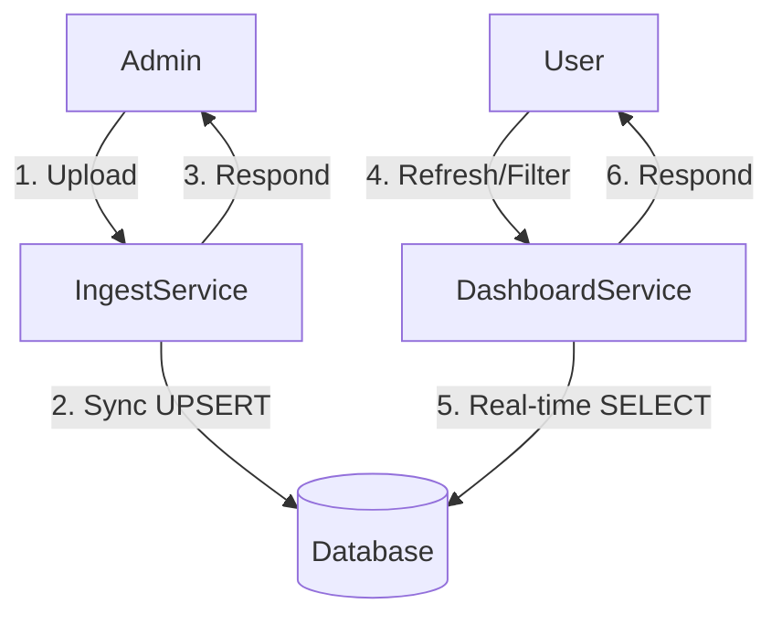

# Implementation Plan: 004. 데이터 반영 정책

이 문서는 유스케이스 명세 `004`에 정의된 데이터 신선도 정책을 구현하기 위한 원칙을 기술합니다.

---

## 개요

별도의 모듈 구현은 필요하지 않습니다. 대신, `Ingest Service`와 `Dashboard Service`가 특정 원칙을 반드시 준수하도록 하여 데이터 신선도를 보장합니다. 핵심은 **"실시간으로 DB에 읽고 쓴다"** 입니다.

| 정책 | 관련 모듈 | 설명 |
| :--- | :--- | :--- |
| **동기 처리 원칙** | `apps/ingest/services.py` | 엑셀 파싱 및 DB 저장은 반드시 동기적으로, 단일 HTTP 요청/응답 사이클 내에서 완료되어야 함. |
| **캐시 미사용 원칙** | `apps/dashboard/services.py` | 데이터 조회 시 캐시를 사용하지 않고, 항상 DB에 직접 쿼리해야 함. |

---

## Diagram

---

## Implementation Plan

### 1. `apps/ingest/services.py` - 동기 처리 보장
-   **구현 원칙:**
    -   `parse_and_save_excel` 함수 내에서 Celery, `threading` 등 비동기/백그라운드 작업을 절대로 사용해서는 안 됩니다.
    -   모든 파일 처리 및 DB 저장 로직은 함수가 반환되기 전에 완료되어야 합니다.

### 2. `apps/dashboard/services.py` - 캐시 미사용 보장
-   **구현 원칙:**
    -   `get_dashboard_data` 함수 내에서 Django의 캐시 프레임워크(`django.core.cache`)나 기타 캐싱 메커니즘을 사용해서는 안 됩니다.
    -   함수는 호출될 때마다 항상 `MetricRecord.objects.filter(...)` 와 같이 DB에 직접 쿼리해야 합니다.

---

## QA Sheet

| 시나리오 | 예상 결과 |
| :--- | :--- |
| **TC-01** | 관리자가 엑셀 업로드에 성공한 직후, 사용자가 대시보드 페이지를 새로고침한다. | 방금 업로드된 데이터가 즉시 차트에 반영된다. |
| **TC-02** | 관리자가 업로드에 실패(e.g., 파일 형식 오류)한 직후, 사용자가 대시보드를 새로고침한다. | 차트 데이터에 아무런 변화가 없으며, 이전 상태를 그대로 유지한다. |
| **TC-03** | 관리자가 부분 성공(Partial Commit)으로 업로드를 마친 직후, 사용자가 새로고침한다. | 성공적으로 커밋된 행의 데이터만 차트에 반영된다. |
