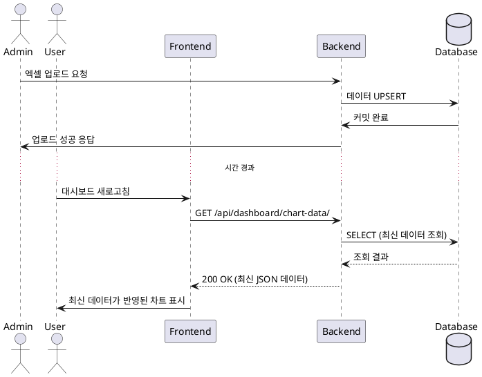

# 유스케이스 명세: 004. 데이터 반영 정책

- **Primary Actor**: 내부 직원 (User), 관리자 (Admin)
- **Precondition**: 관리자가 엑셀 업로드를 성공적으로 마쳤다.
- **Trigger**: 사용자가 대시보드 페이지를 새로고침하거나 필터를 재적용한다.

---

### Main Scenario (사용자 관점)

1.  관리자가 엑셀 업로드를 완료하여 데이터베이스가 최신 상태로 업데이트된다.
2.  내부 직원이 대시보드 페이지(`/dashboard/`)에 접속하거나, 보고 있던 페이지를 새로고침(F5)한다.
3.  브라우저(FE)는 `/api/dashboard/chart-data/`를 다시 호출한다.
4.  시스템(BE)은 캐시 없이 DB에서 **가장 최신 데이터**를 직접 조회한다.
5.  브라우저(FE)는 새로 받은 데이터로 차트를 다시 그려, 방금 업로드된 내용이 반영된 차트를 사용자에게 보여준다.

---

### Edge Cases

-   **업로드 중 조회**: 관리자가 데이터를 업로드하는 도중에 직원이 대시보드를 조회하면, 업로드가 커밋되기 전의 **이전 데이터**가 보인다.
-   **부분 성공 업로드 조회**: 업로드 시 일부 행이 실패하고 부분적으로만 커밋(Partial Commit)된 경우, 사용자는 **성공적으로 커밋된 행만** 반영된 차트를 보게 된다.
-   **페이지를 띄워놓고 있는 경우**: 사용자가 대시보드 페이지를 닫거나 새로고침하지 않으면, 데이터가 새로 업로드되어도 차트는 갱신되지 않는다.

---

### Business Rules

-   **데이터 신선도(Freshness)는 '조회 시점의 DB 상태'를 따른다.** (Read-on-Request)
-   **캐싱(Caching)은 사용하지 않는다.** 모든 API 요청은 DB에 직접 질의한다.
-   **비동기 처리(Asynchronous Task)는 없다.** 엑셀 업로드는 요청-응답 사이클 내에서 동기적으로 완료되며, 완료 즉시 데이터 조회가 가능하다.
-   데이터가 언제 업데이트되었는지 알려주는 '마지막 업데이트 시각' 표시는 선택 사항이며 MVP 범위에 필수는 아니다.

---

### Sequence Diagram

